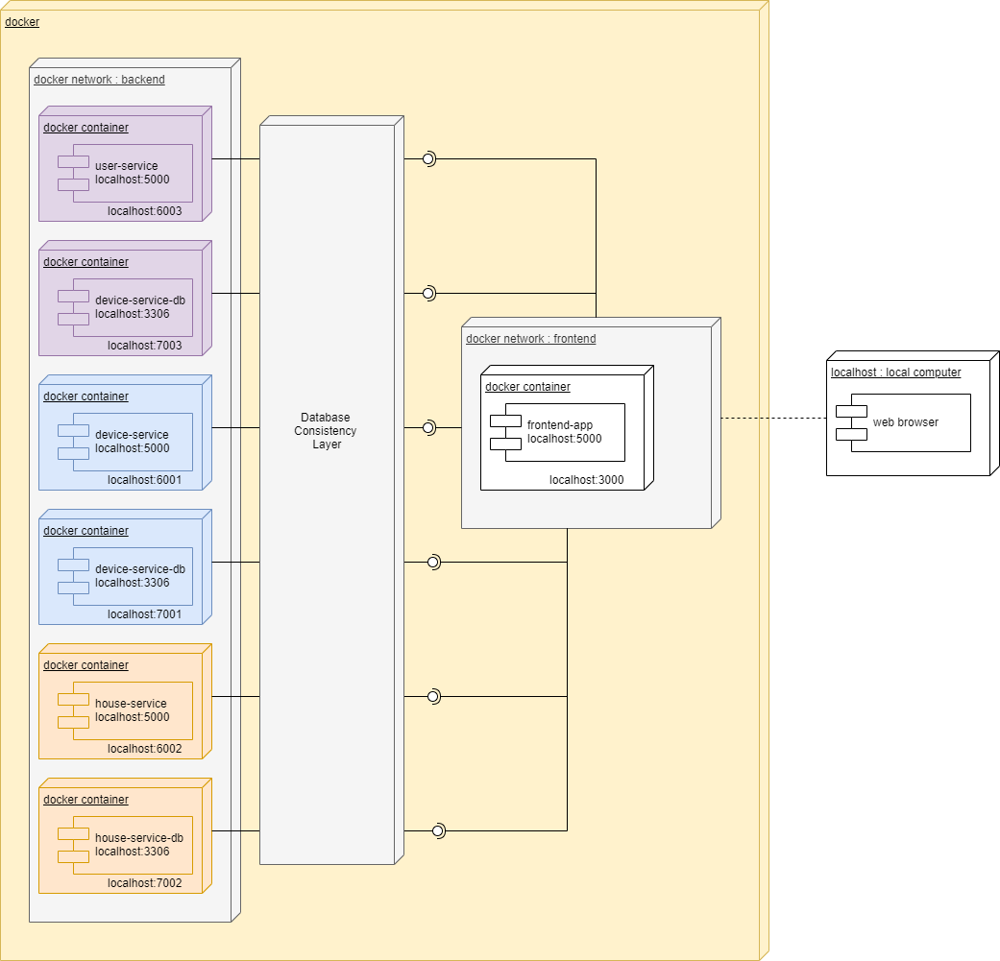
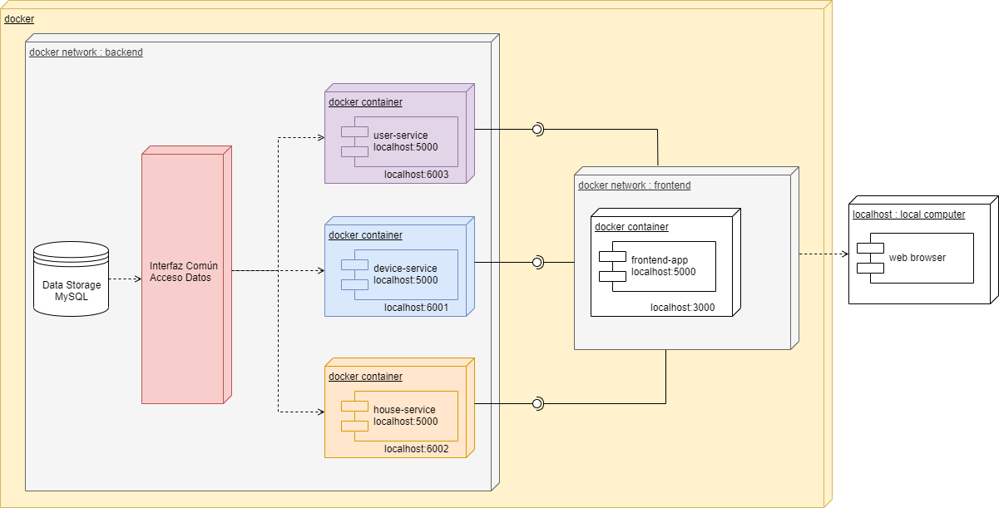
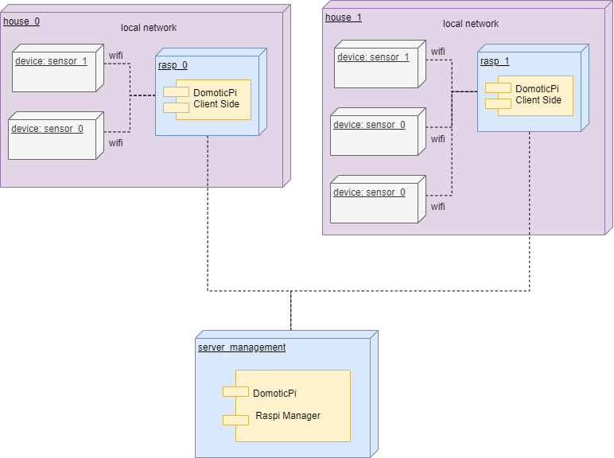
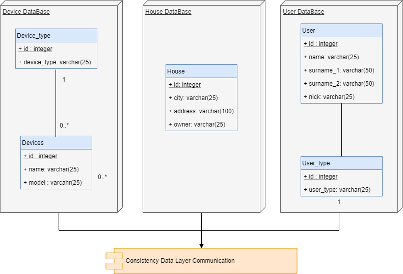
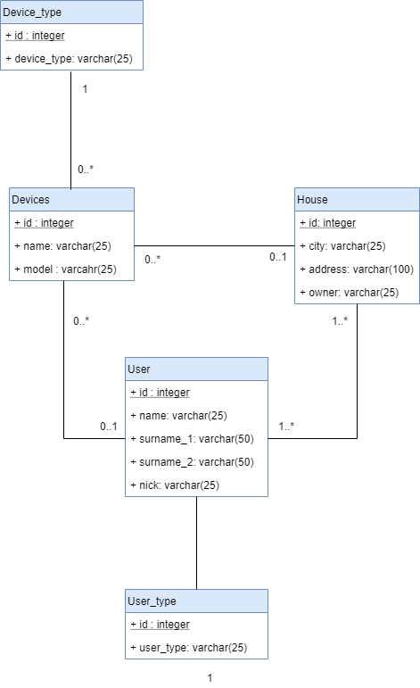
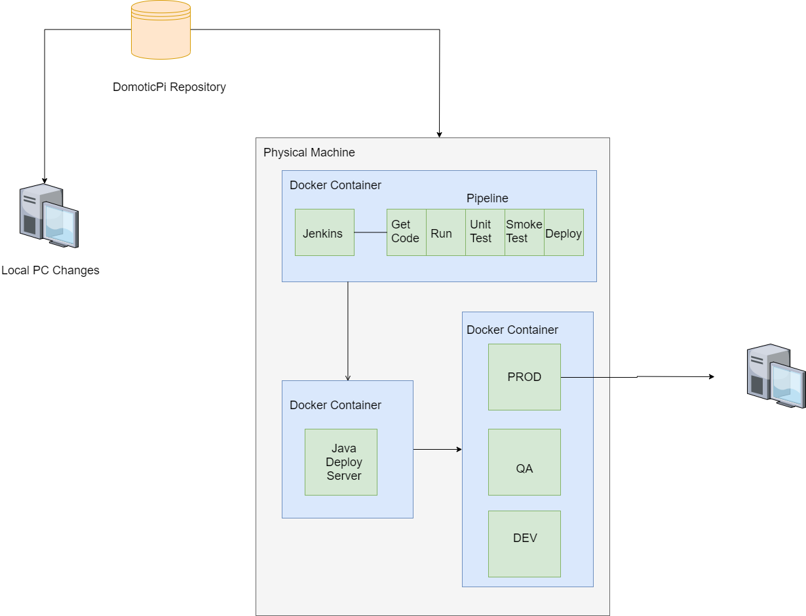
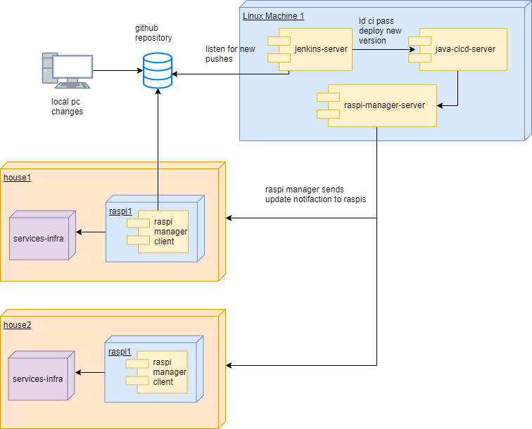
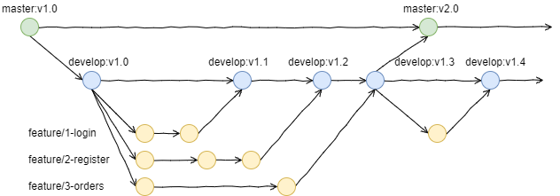

# DomoticPi

In this repository you can find the whole project and infraestructure for DomoticPi. A private project to make your house domotic in a low cost way. The main idea is to have a raspi in every house as a central server. The raspi is managed from a remote server by the company. The raspi will be able to manage the ligths and other devices selected by the user. In this repository you'll find all the code in order to make this small project works. 

### Table of Contents
---

1. [DomoticPi](#domoticpi) 
2. [Table of Contents](#table-of-contents)
3. [Tools used in the project](#table-of-contents)
4. [Useful Commands](#useful-commands)
5. [Useful Information](#useful-information)
   1. [Services Port Forwarding](#services-port-forwarding)
   2. [Databases Port Forwarding](#databases-port-forwarding)
   3. [Services Architecture](#services-architecture)
   4. [Infrastructure Architecture](#infrastructure-architecture)
   5. [Entity Relation Diagram](#entity-relation-diagram)
6. [To do list](#to-do-list)

### Tools used in the project
---

Main tools used in the project are: 
- **Docker**: there is a full service infrastructure to orchestrate the environments. Each service is into a container, and each db service is also in its own container.
  - **Docker-compose**: the above infrastructure is easily orchestrated with docker-compose command. This way for the deploys made it available for windows or even linux platforms. The main idea is deploy the whole system in Linux based computers. 
  - **Docker hub**: above containers are based on 2 images, which can be found in docker-hub. 
- **Python**: main developing language is python. Backend and frontend are written in python. Original idea was use NodeJS for the backend and Python with a simple flask application for the frontend. But MySQL was updated to 8.X version and MySQL connectr for node wasn't updated and there was several incompatibilities. In some far future, backend services could be in NodeJS. 
  - **Flask**: flask application as a simple way to server HTTP pages and create REST API servers. In a few lines you can deploy webpages and connect services to the databases. 
- **MySQL**: relational database to serve the information. use MongoDB as a future enhacement becase the data allow it and it's a simpleway to mangae updates in schema and data management. 
- **Github**: github as a simple SCV and project management software. 
- **VSCode**: VSCode as a simple editor. 
- **Jenkins**: future improvement for CI/CD automation. Still not implemented. 

### Useful Commands
---

Some useful commands to deploy the services:
- **Build Dockerfile**: `docker build -t device-service .`
- **Create docker local network**: `docker create network -d bridge network_name`
- **Run Service container**: `docker run -p -d 5000:5000 --name device-service --net=devices-nw device-service`
- **Run MySQL container**: `docker run -p 3306:3306 --name device-service-db -e MYSQL_ROOT_PASSWORD=device-service -d --net=services-nw device-service-db`
- **Start Services**: `docker-compose up`
- **Stop Services**: `docker-compose down`
- **Start services container**: `docker run -it sergioestebanp/domoticpi:services-1.0`
- **Enter in running container**: `docker exec -it container_name bash`
- **Install python packages in containers**: `pip3 install packageName`
- **Create container image from existing**: `docker commit sha256 sergioestebanp/domoticpi:tagName`
- **Upload image container to docker-hub**: `docker push sergioestebanp/domoticpi:tagNameContainer`

### Useful information
---

#### Services Port forwarding

| Service          | Port outside container  |  Port Forwarded |
| ---------------- |:-----------------------:|:---------------:|
| device-service   | 6001                    | 6001            |
| house-service    | 6002                    | 6002            |
| user-service     | 6003                    | 6003            |

#### Databases Port forwarding

| Service            | Port outside container  |  Port Forwarded |
| ------------------ |:-----------------------:|:---------------:|
| database-service   | 3306                    | 3306            |

#### Services Architecture
There are two approaches to achieve the infrastructure we want here:
1. Using a pure microservices architecture. With one services accesing its own db. And communicating them with an event handler and with an intermediate layer to have the proper consistency in the database. Using this architecture we avoid the issue with lots of hits using the databse and keeping consistency depends on external middleware. We can see this architecture and solution in the following image: 

2. Other solution, more classic: use only one database for all services and all the services accessing to it. We decide to use this architecture due to the lack of high hits to the API and also to the Database. This database is supossed to be designed only once and modifications are rare. only if customer wants to add new devices. We can see the architecture mentioned abode in the following picture:

#### Infrastructure Architecture

#### Entity Relation Diagram
Depending on the solution we choose as main infrasctructure, we are going to have a different set up for the databases. The models are the following:
1. Solution with middleware: this solution is the most suitable in order to follow a pure microservices architecture becase each microservice access to its database. But here we need an extra layer which means a little more complexity for the system. 

2. Solution without: by this way we just have the typical entity relation diagram in one unique database. We have 5 tables wit the relations described in the below diagram. By this way we avoid to implement an extra layer to mantain the data consistency, because all the operations performed in a table trigger needed changes in the other tables if needed. This way has a more coupled and tight architecture becasue all data is sotrage in one unique database. It's a single point of failure and any service should be able to work if database is down. For the future we consider change this relational approach for a non relation with ditributed database and node replication in case of failure, like MongoDB.

#### CI/CD Flow and Charts
This project supose to be fully automated. The deplyment is completely automated. The principal flow is as following: 
1. Developer change local code and tries if things works as expected in their local machines. 
2. Developer push local changes to the repository in a separate branch. Then they made a PR for the env they want to make the deploy. In most of the cases this PR goes against DEV, besides its a hotfix and the PR were made against PROD directly. 
3. Jenkins server running in a different machine detects the change in the repository and triggers the build for CI and CD. In this initial pipeline the new code pass the unit testing and then the smoke tests against backend and frontend services. 
4. One the unit and smoke tests passed successfully and only the status is successful, then the deploy is done in the proper environment. The pipeline sends a command to the CD server, where a simple Java server listen the requests. Then the server executes the proper commands tu run the services and deploy applications in the environment. 
You can see the flow in the following chart: 

Above process is perfect for test local changes, but not suitable to delivery new updates into productino environment. The following process is better in order to deploy new services in productino or selected environment: 

#### Git flow

This project follows a simple branch strategy based on git workflow. We have the following branches: 
- **master**: only has stable versions of the final product. Each new version deploy in master shoul be tagged properly. 
- **develop**: storages a bunch of new functinoalites. When there are enough new functions then a new release and PR against master is done to create a new version of the product. 
- **feature/ID-feature-name**: this branches comes from master directly, with the new features to implement. This branches could be merged only against develop. Never against master.
- **hotfix**: this branches comes always from master and could be only merge with master. They introduce bugfixes for issues in production with high risk for the product. 
You can find a detailed model in the following picture: 

